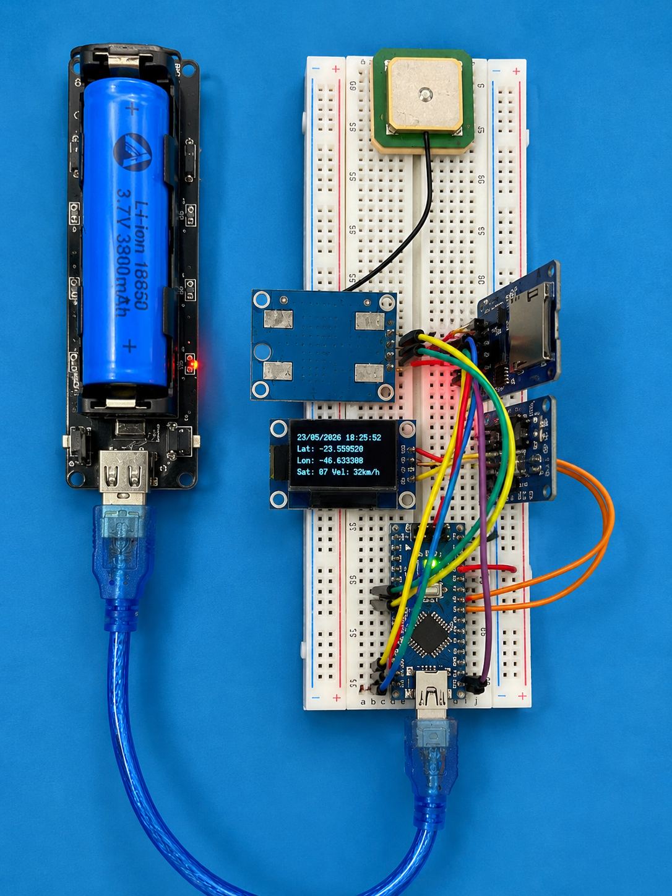

# Sistema de Telemetria GPS com ESP32

Projeto experimental de telemetria utilizando ESP32 para captura de localização geográfica, armazenamento em cartão SD e visualização posterior através de uma aplicação Python.

---

# Objetivo

Desenvolver uma solução de baixo custo para registro de rotas e monitoramento de deslocamentos utilizando componentes amplamente disponíveis para aplicações educacionais e prototipagem.

---

# Arquitetura da Solução

```text
GPS NEO-6M
      ↓
ESP32
      ↓
RTC DS3231
      ↓
Cartão SD (CSV)
      ↓
Aplicação Python
      ↓
Mapa Interativo
```

---

# Componentes Utilizados

## Hardware

- ESP32-WROOM-32
- GPS NEO-6M
- RTC DS3231
- Módulo Cartão SD
- Display OLED SSD1306
- Protoboard
- Jumpers
- Bateria 18650 / Power Bank

## Software

- Arduino IDE
- Python 3.x
- Pandas
- Folium
- SQLite
- Git
- GitHub

---

# Estrutura do Projeto

```text
iot-telemetria
│
├── arduino
│   └── gps_logger
│
├── python
│   └── mapa_rotas
│
├── docs
│
├── imagens
│
├── exemplos
│
├── dados-exemplo
│
└── README.md
```

---

# Funcionalidades

- Captura de coordenadas GPS
- Registro de data e hora utilizando RTC
- Gravação automática em cartão SD
- Exibição das coordenadas em display OLED
- Armazenamento em formato CSV
- Importação dos dados em Python
- Visualização da rota em mapa interativo

---

# Aplicações

- Rastreamento experimental de veículos
- Estudos de logística
- Telemetria educacional
- Projetos de IoT
- Geolocalização
- Registro de trajetos
- Aprendizado de integração hardware/software

---

# Montagem do Protótipo

## Visão Geral

<p align="center">
  
      
</p>

<p align="center">
  <em>Objetivo final com os dados coletados sendo apresentados em uma aplicação Python.</em>
</p>

---

# Evolução da Montagem

<p align="center">
  
  
  
</p>

<p align="center">
  <em>Evolução da montagem do protótipo.</em>
</p>

---

# Fluxo de Funcionamento

1. O GPS obtém a posição geográfica.
2. O RTC fornece data e hora precisas.
3. O ESP32 processa as informações.
4. Os dados são gravados em um arquivo CSV no cartão SD.
5. O arquivo CSV é importado para uma aplicação Python.
6. A aplicação gera um mapa interativo contendo a rota percorrida.

---

# Dados de Exemplo

A pasta:

```text
dados-exemplo
```

contém arquivos CSV gerados pelo sistema para testes da aplicação Python sem necessidade do hardware.

---

# Roadmap

## Versão 1.0

- GPS NEO-6M
- RTC DS3231
- Cartão SD
- Registro em CSV

## Versão 2.0

- Integração com OLED SSD1306
- Exibição de Latitude e Longitude

## Versão 3.0

- Aplicação Python para visualização da rota
- Mapa Interativo

## Versão 4.0

- Dashboard Web
- Estatísticas de deslocamento

## Versão 5.0

- Telemetria em tempo real via MQTT
- Integração com Home Assistant

---

# Resultados Esperados

- Registro contínuo das coordenadas geográficas
- Armazenamento seguro em cartão SD
- Consulta posterior dos trajetos percorridos
- Visualização gráfica em mapas
- Base para projetos de rastreamento e logística

---

# Próximas Implementações

- Publicação do código Arduino
- Publicação da aplicação Python
- Inclusão de fotos detalhadas da montagem
- Inclusão do esquema elétrico
- Inclusão da lista de materiais completa
- Inclusão de vídeo demonstrativo
- Inclusão de dados reais coletados em campo

---

# Autor

Luis Claudio Buratini

**Technology Manager | IT Governance | Problem Management | Data Science | AI & IoT**

- GitHub: https://github.com/lcburatini
- LinkedIn: (adicionar posteriormente)

---

# Licença

Projeto desenvolvido para fins educacionais, experimentais e de aprendizado.

Sinta-se à vontade para estudar, adaptar e evoluir a solução.
